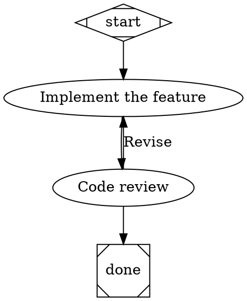

# Attractor

A Go implementation of the [Attractor](https://factory.strongdm.ai/) software factory — a three-layer system for building agentic AI workflows.

## Architecture

```
┌──────────────────────────────────────────────────┐
│  Layer 3: Pipeline Engine                        │
│  DOT-based DAGs for multi-stage AI workflows     │
├──────────────────────────────────────────────────┤
│  Layer 2: Coding Agent Loop                      │
│  Programmable agentic loop with tool execution   │
├──────────────────────────────────────────────────┤
│  Layer 1: Unified LLM Client                     │
│  Provider-agnostic interface (OpenAI / Anthropic / Gemini) │
└──────────────────────────────────────────────────┘
```

**Unified LLM Client** — Provider-agnostic interface with streaming, tool calling, retry logic, and middleware. Supports OpenAI, Anthropic, and Gemini through a common `ProviderAdapter` interface.

**Coding Agent Loop** — Programmable agentic loop that cycles through LLM calls and tool execution. Includes provider-aligned profiles (each model family gets its native tool format), two-stage output truncation, loop detection, and an event system for real-time UI.

**Pipeline Engine** — Executes multi-stage AI workflows defined as [Graphviz DOT](https://graphviz.org/doc/info/lang.html) directed graphs. Features 9 built-in node handlers, a condition expression language, human-in-the-loop gates, checkpoint-based recovery, and a CSS-like model stylesheet system.

## Getting Started

### Prerequisites

- Go 1.21+
- At least one LLM provider API key

### Install

```bash
go install github.com/ashka-vakil/attractor/cmd/attractor@latest
```

Or build from source:

```bash
git clone https://github.com/ashkavakil/attractor.git
cd attractor
go build -o attractor ./cmd/attractor
```

### Set an API key

```bash
# Pick one (or more)
export ANTHROPIC_API_KEY="sk-ant-..."
export OPENAI_API_KEY="sk-..."
export GEMINI_API_KEY="..."
```

### Run a pipeline

```bash
attractor run pipeline.dot
```

### Start an agent session

```bash
attractor agent "Fix the failing tests in pkg/server"
```

### Validate a pipeline

```bash
attractor validate pipeline.dot
```

### Start the HTTP server

```bash
attractor serve --addr :8080
```

## CLI Reference

```
attractor <command> [options]

Commands:
  run       Execute a DOT pipeline file
  agent     Start an interactive coding agent session
  serve     Start the HTTP pipeline server
  validate  Validate a DOT pipeline file
  version   Print version
```

### `attractor run`

```
attractor run [options] <pipeline.dot>

Options:
  -logs string   Directory for pipeline logs (default: temp dir)
```

### `attractor agent`

```
attractor agent [options] [prompt]

Options:
  -model string      Model to use (e.g., claude-opus-4-6, gpt-4.1)
  -provider string   Provider (anthropic, openai, gemini)
  -max-turns int     Maximum number of turns (0 = unlimited)
```

### `attractor serve`

```
attractor serve [options]

Options:
  -addr string   Listen address (default: ":8080")
```

#### HTTP API

| Method | Path | Description |
|--------|------|-------------|
| `POST` | `/pipelines` | Create and run a pipeline (`{"dot_source": "..."}`) |
| `GET` | `/pipelines/{id}` | Get pipeline status and result |
| `GET` | `/pipelines/{id}/events` | SSE event stream |
| `POST` | `/pipelines/{id}/cancel` | Cancel a running pipeline |
| `GET` | `/pipelines/{id}/context` | Get pipeline context/outcomes |

## Pipeline DSL

Pipelines are written as DOT digraphs with extended attributes:



### Node shapes

| Shape | Handler | Purpose |
|-------|---------|---------|
| `Mdiamond` | start | Pipeline entry point |
| `Msquare` | exit | Pipeline terminal |
| `box` | codergen | LLM task execution (default) |
| `hexagon` | wait.human | Human interaction gate |
| `diamond` | conditional | Conditional branching |
| `component` | parallel | Fan-out to branches |
| `tripleoctagon` | parallel.fan_in | Consolidate parallel results |
| `parallelogram` | tool | External command execution |
| `house` | stack.manager_loop | Manager-run loop pattern |

### Edge conditions

```dot
a -> b [condition="outcome = success"]
a -> c [condition="outcome = fail"]
a -> d [condition="context.review_approved = true && outcome = success"]
```

### Model stylesheet

```dot
digraph {
    model_stylesheet = "
        * { llm_model: claude-sonnet-4-5-20250929 }
        .critical { llm_model: claude-opus-4-6; reasoning_effort: high }
        #final_review { llm_model: gpt-4.1 }
    "
    // ...
}
```

## Project Structure

```
├── cmd/attractor/          CLI binary
├── pkg/
│   ├── llm/                Unified LLM Client
│   │   ├── types.go        Core types (Message, Tool, Request, Response)
│   │   ├── client.go       Client routing, middleware, FromEnv discovery
│   │   ├── generate.go     High-level API (Generate, Stream, GenerateObject)
│   │   ├── retry.go        Retry with exponential backoff
│   │   └── provider/       Provider adapters
│   │       ├── anthropic/  Claude (Messages API)
│   │       ├── openai/     GPT (Chat Completions API)
│   │       └── gemini/     Gemini (GenerateContent API)
│   ├── agent/              Coding Agent Loop
│   │   ├── session.go      Core agentic loop engine
│   │   ├── profile.go      Provider-aligned profiles and system prompts
│   │   ├── env/            Local tool execution (bash, file ops, grep, glob)
│   │   └── tools/          Tool JSON schema definitions
│   └── pipeline/           Pipeline Engine
│       ├── engine.go       Execution engine with retry and edge selection
│       ├── parser.go       DOT format parser
│       ├── lexer.go        DOT format lexer
│       ├── validate.go     13 built-in lint rules
│       ├── server.go       HTTP API with SSE events
│       ├── handler/        9 built-in node handlers
│       ├── condition/      Edge condition expression language
│       ├── stylesheet/     CSS-like model stylesheet
│       └── transform/      Graph transformations
└── internal/testutil/      Test utilities (MockAdapter, SSE helpers)
```

## Using as a Library

### Unified LLM Client

```go
import (
    "github.com/ashka-vakil/attractor/pkg/llm"
    _ "github.com/ashka-vakil/attractor/pkg/llm/provider/anthropic"
    _ "github.com/ashka-vakil/attractor/pkg/llm/provider/openai"
)

client := llm.FromEnv()
defer client.Close()

resp, err := client.Complete(ctx, &llm.Request{
    Model:    "claude-sonnet-4-5-20250929",
    Messages: []llm.Message{{Role: llm.RoleUser, Content: "Hello"}},
})
```

### Coding Agent

```go
import "github.com/ashka-vakil/attractor/pkg/agent"

profile := agent.DefaultAnthropicProfile("claude-sonnet-4-5-20250929")
session := agent.NewSession(client, profile, nil, agent.DefaultSessionConfig())
defer session.Close()

session.EventEmitter.On(func(e agent.Event) {
    fmt.Println(e.Type, e.Data)
})

err := session.Submit(ctx, "Fix the bug in auth.go")
```

### Pipeline Engine

```go
import (
    "github.com/ashka-vakil/attractor/pkg/pipeline"
    "github.com/ashka-vakil/attractor/pkg/pipeline/handler"
)

registry := handler.NewRegistry(backend, &handler.AutoApproveInterviewer{})
runner := pipeline.NewRunner(registry, pipeline.WithLogsRoot("./logs"))

result, err := runner.RunFromFile("pipeline.dot")
```

## Specifications

This implementation is based on the [Attractor NLSpecs](https://factory.strongdm.ai/):

- **Attractor Spec** — DOT pipeline DSL, execution algorithm, node handlers, state management
- **Coding Agent Loop Spec** — Agentic loop, session lifecycle, tool execution, provider alignment
- **Unified LLM Spec** — Four-layer architecture, provider adapters, streaming, error handling

## License

Apache 2.0
